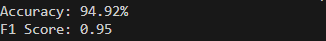

# E-Commence Text Classification

## Overview
This repository contains an **E-Commence Text Classification** project designed to classify text data into predefined categories. The project leverages Recurrent Neural Network with Bidirectional LSTM techniques to preprocess data, train models, and evaluate performance.

## Table of Contents
1. [Installation](#installation)
2. [Execution](#execution)
3. [Model Architecture](#modelarchitecture)
4. [Performance](#performance)
5. [Dataset Credit](#credit)
## Installation
Clone this repository:
   
   git clone https://github.com/rahimnasir/e-commence-text-classification.git

## Execution
Run the py file on VSCode

## Model Architecture

## Performance

# Dataset Credits

This project uses the **Ecommerce Text Classification Dataset** for text classification:

- **Dataset Name**: [E-Commerce Text Classification](https://www.kaggle.com/datasets/saurabhshahane/ecommerce-text-classification)